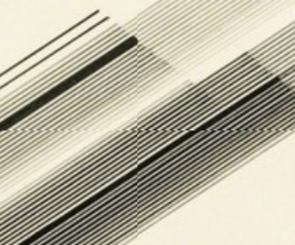
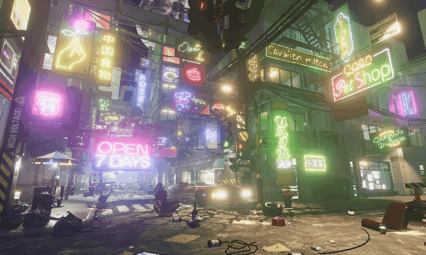
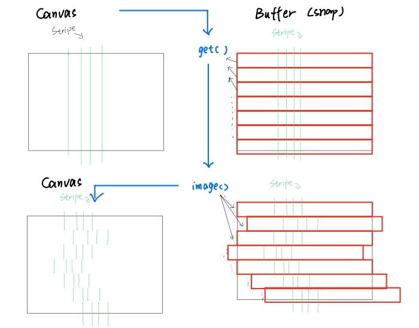

 # czhu0489_Cheng-Zhu_tut09_groupC
 **Creative Coding Major Project**
# Individual Task: Perlin Noise and Randomness

## Instructions:
1. Load the page, click the button or change the page size
2. wait for the image to be generated. (about 5 seconds)
3. The `index.html` runs the code in `sketch.js`, which is the final result of my task. `Iterations.js` is only a recording for ideas and iterations.

## Key features:
Adapted from group task (https://github.com/TTTED123/MajorProduct_9103_Group_-Somwrita-C) using **Perlin noise** to add dynamic disturbance effects.

## Inspiration:
At first, I tried to retain Mohamedi's artistic style, which is composed of **black and white straight lines**. However, since the code of our group itself is already a style for generating art, with various parameters being relatively random, any processing of parameters such as the generation position, spacing, length, etc. of the lines by applying perlin noise would not lead to significant changes in the visual effect. 

Later, I saw this picture, which is a **2D noise field** generated by perlin noise.

This screenshot inspired me to design variations in **light and shade** to the lines, creating a **"breathing" effect**. Relevant codes are in `Iterations.js` (Lines 49-51, 141-147), and the visual effects are as below gif.

However, I found that this adaptation lacked significant visual effect. So I returned to the picture my group chose and observed its features. 

Here I noticed that in her work, there are **tiny disturb effect**, which perhaps can be presented by perlin noise. 
Furthermore, this also reminded me of the RGB disturbed images mentioned in my previous quiz. 

So, I decided to use **perlin noise** to achieve the following effect: certain parts of the image would undergo a **disturbance effect** as the **timer** cycles.

## Technical overview:
### Core Components
My individual code consists of some global variable, a function "disturbPixels()", a function "disturbAnimation()", and implement of "disturbAnimation()" in draw().

1. Global variables:
The global variables includes disturbed state, animation timer, animation interval, animation duration, as well as variable containers for the disturbed state and the initial state images.

2. Logic:
The running logic of the code is to call the function "disturbAnimation()" within the "draw()" function, and then within "disturbAnimation()", it calls the function "disturbPixels()" in a timer loop to achieve the effect of a timed cyclic animation.

3. Key functions:
I used createGraphic() in the code, which was not covered in the course. It can create a temporary graphics buffer not shown on the canvas to handle disturbing process and cover the final image to the canvas. By combining this function with get() and image(), one can achieve the effect of local disturbance on the image.

4. Workflow:
The basic principle of disturbing is (taking the horizontal direction as an example):
 Use the get() function to create a snap, 
 Divide it into several rows at the height of the step, 
 Applying disturbing processing to several of these rows based on the random rate. 
 Both the processed and unprocessed rows will be composited into a temporary graphics buffer, 
 Draw image in the buffer onto the canvas after all processing is completed.

Here is also a handsketch for explaning the process.

---

## Reference
The Coding Train. (2017). Perlin Noise in Two Dimensions (p5.js) [video]. https://www.youtube.com/watch?v=ikwNrFvnL3g
QianMo. (2020). GlitchRGBSplit. https://github.com/QianMo/X-PostProcessing-Library/tree/534a22613af8a29ab5719e9e529ccd4ef214da3a/Assets/X-PostProcessing/Effects/GlitchRGBSplit